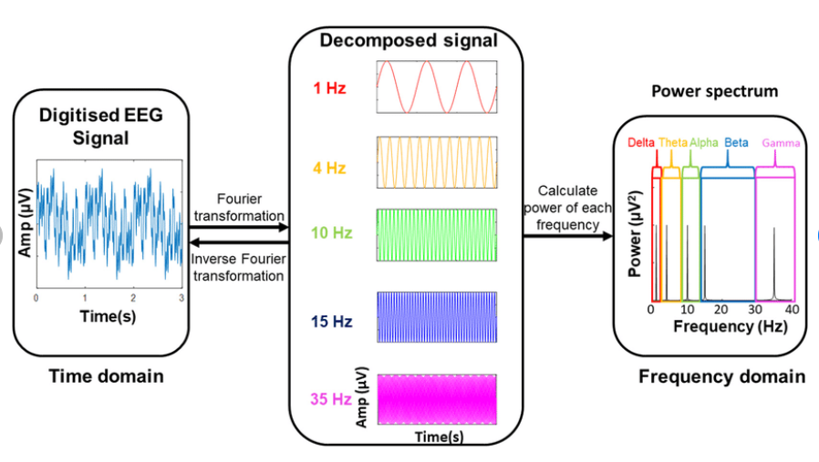

# Fast Fourier Transformation (FFT):- 

The Fourier Transform is a mathematical technique that transforms a function of time, x(t), to a function of frequency, X(ω). It is closely related to the Fourier Series. A Fast Fourier transform (FFT) is an algorithm that computes the discrete Fourier transform (DFT) of a sequence, or its inverse (IDFT). Fourier analysis converts a signal from its original domain (often time or space) to a representation in the frequency domain and vice versa.

Fourier Transformation is one of the techniques to reveal the frequency contents of the EEG signals at each time point.

## Calculation of FFT:-

The FFT operates by decomposing an N point time domain signal into N time domain signals each composed of a single point. The second step is to calculate the N frequency spectra corresponding to these N time domain signals. Lastly, the N spectra are synthesized into a single frequency spectrum. separate stages.

## Output of FFT:-

You can find more information on the FFT functions used in the reference here, but at a high level the FFT takes as input a number of samples from a signal (the time domain representation) and produces as output the intensity at corresponding frequencies (the frequency domain representation).

 

  

 

