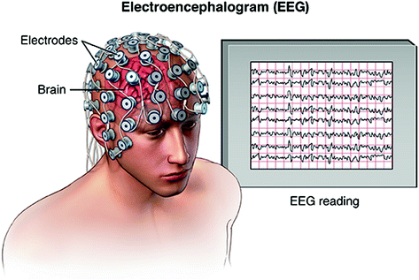

# Emotion-classification-Using EEG Data

## AMIGOS DATASET (A dataset for affect, personality and mood research on individuals and groups)

## PROBLEM STATEMENT:-

It is difficult to look at the EEG signal and identify the state of Human mind. In this problem statement a classifier needs to be trained with AMIGOS dataset to predict the state of mind. The state of mind is predicted in terms of valence, arousal. which can further be used to predict the state of mind in terms of expression.

 

  

 

## PROCEDURE TO SOLVE THE PROBLEM:-

The Preprocessed Data is used for training the classifier.
Steps involve in training the dataset:-

1. Extracting the dataset
2. Finding the features
3. Reducing the dimension
4. Training the vector.
5. Checking the Classifier efficiency.

## DATASET DESCRIPTION:-

The AMIGOS dataset consists of the participants' profiles (anonymized participants' data, personality profiles and mood (PANAS) profiles), participant ratings, external annotations, neuro-physiological recordings (EEG, ECG and GSR signals), and video recording (frontal HD, full-body and depth videos) of two experiments:

1. Short videos experiment: In this experiment, 40 volunteers watched a set of 16 short affective video extracts from movies. Each participant was in individual settings and rated each video in valence, arousal, dominance, familiarity and liking, and selected basic emotions (Neutral, Happiness, Sadness, Surprise, Fear, Anger, and Disgust) that they felt during the videos.

2. Long videos experiment: In this experiment, 37 of the participants of the previous experiment watched a set of 4 long affective video extracts from movies. 17 of the participants performed the experiment in individual setting while the other 20 participants did it in group setting, in 5 groups of 4 people. Each participant rated each video in valence, arousal, dominance, familiarity and liking, and selected basic emotions (Neutral, Happiness, Sadness, Surprise, Fear, Anger, and Disgust) that they felt during the videos.

## FINDING THE FEATURES:-

Wavelet transform and Fast Fourier Transform is used to decompose the each channel data into the five features i.e :-

- **Delta (< 4 Hz)**
- **Theta (5-7 Hz)**
- **Alpha (8-15 Hz)**
- **Beta (16-31 Hz)**
- **Gamma (> 32 Hz)**

Energy and Entropy is computed for each feature band from each channel

- **For wavelet features `Total Wavelet Entropy` is calculated**
- **For fourier features `Spectral Entropy` is calculated**

## Usage

- `DataConversion`: Code to convert the amigos dataset from `matlab files` into `csv files`
- `Dataset`: `Transformed data` to all users in `pickle` format
- `Fourier`: Code for `fourier transformation`
- `Wavelet`: Code for `wavelet transformation`
- `Src`: Code to apply the wavelet and fourier transformation on raw data and store the data into dataset
- `Models`: Code for different `Machine Learning` and `Deep Learning` `methods` applied

## Results

### Results on Valence and Arousal

| **Preprocessing Technique**             | **Methods** | **Valence(Acc)** | **Arousal(Acc)** |
| --------------------------------------- | ----------- | ---------------- | ---------------- |
| `Wavelet(Total Wavelet Entropy)`        |             |                  |                  |
|                                         | `ANN`       | `0.627`          | `0.714`          |
|                                         |             |                  |                  |
|                                         | `SVC`       | `0.638`          | `0.726`          |
|                                         |             |                  |                  |
| `Fourier(Spectral Entropy)`             |             |                  |                  |
|                                         | `ANN`       | `0.675`          | `0.689`          |
|                                         |             |                  |                  |
|                                         | `SVC`       | `0.655`          | `0.668`          |
|                                         |             |                  |                  |
| `Sort Time Fast Fourier Transformation` |             |                  |                  |
|                                         | `CNN`       | `0.94`           | `0.96`           |
|                                         |             |                  |                  |

## Contributers

<table>
  <tr>
    <td align="center"><a href="https://github.com/soumyajit4419"> <b>Soumyajit Behera</b></a> </td>
    <td align="center"><a href="https://github.com/Rahul1582"> <b>Rahul Kumar Patro</b></a> </td>
  </tr>
</table>
