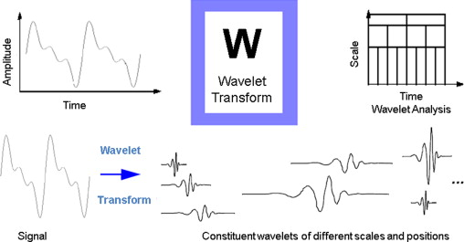

# Wavelet Transformation :- 

The Wavelet transform is similar to the Fourier transform with a completely different merit function. The main difference is this: Fourier transform decomposes the signal into sines and cosines, i.e. the functions localized in Fourier space; in contrary the wavelet transform uses functions that are localized in both the real and Fourier space. 

Types of Wavelet Transform is divided into 2 classes:

- **Continuous Wavelet Transform (CWT)**
- **Discrete Wavelet Transform (DWT)**

The EEG signal is first decomposed using wavelet decomposition scheme into wavelet coefficients using db3 (level = 3) or db4 (level = 4) for reducing signal dimension. These decomposed coefficients are used as features wchich describes the signal. 

After extracting the features of the EEG signal, classification is done.

## Output of Wavelet Transform:-

The outputs A and D are the reconstruction wavelet coefficients:

A:  The approximation output, which is the low frequency content of the input signal component.

D:  The multidimensional output, which gives the details, or the high frequency components, of the input signal at various levels (up to level 6).

 

  

 

